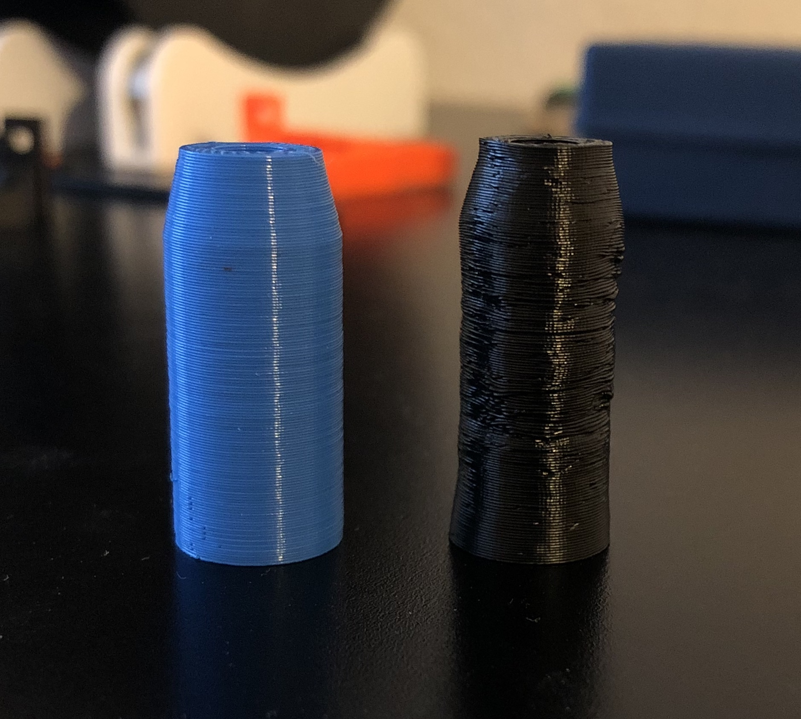
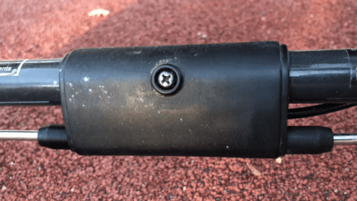

Prologue
========

One and a half years ago we bought a _Baby Jogger City Mini GT_ stroller for our daughter. It's a nice stroller, but after about three months the breaks broke down. I reported this issue to Amazon, and they sent a replacement. The tracking never worked, the replacement never arrived. Then Amazon sent the second replacement. The tracking worked until customs, the replacement never arrived. Then the Amazon support told me that they would be happy to send yet another replacement, but they ran out of stock, and thus they will refund us. As a result, we ended up with a "free" stroller, where only one wheel was breaking. I thought about buying a replacement break set but never did it because the cost was about 1/3 of the stroller's price. We ended up in an incomplete state: replacement was expensive; the stroller was spinning around the locked wheel when left alone in a public transport; our daughter wasn't using the stroller any way…

Recreation of the Broken Part
=============================

On one Saturday I realized that the breaks are not working most likely because some plastic part broke. And if it is a plastic part, I can print it.

It was quite complicated to design the broken part from scratch as the mechanism is not symmetric. But I worked my way out with the help of my trusty calipers and by printing many prototypes in a cheap blue PLA.

The final challenge occurred when I tried to print the final version in a black ABS-X (by Dutch Filaments) to have matching color and, of course, benefit from increased durability. First of all, my perfectly-sized holes ended up being too small because of the ABS shrinkage ratio. However, the main unforeseen issues occurred because the model was small and narrow. The previous layers of my print didn't have enough time to solidify before the printer laid new plastic on top. To overcome this, I had to print two copies of the model on the opposite sides of the print surface and slow down the printer significantly.

Epilog
======

This story is not about advanced 3D modeling — the replacement part that I created is very simple. Neither is this story about a complicated 3D printing techniques — the printing that I did was relatively simple (besides the lack of cooling). This story is about happiness. Finally, I don't have to decide whether I should buy expensive replacement breaks, or whether I should live with a broken stroller. Because I'm a maker, and if some plastic thing shattered I can make a new one. Our family is happy, and this is what matters.

